# Hi there! 👋 I'm masaaya

## 📊 GitHub Statistics

### 📈 Overview

### 💻 Most Used Languages

### 📅 Contribution Calendar

### 🎯 Recent Activity

### 🏆 Achievements & Notable Contributions

## 🛠️ Technologies & Tools

